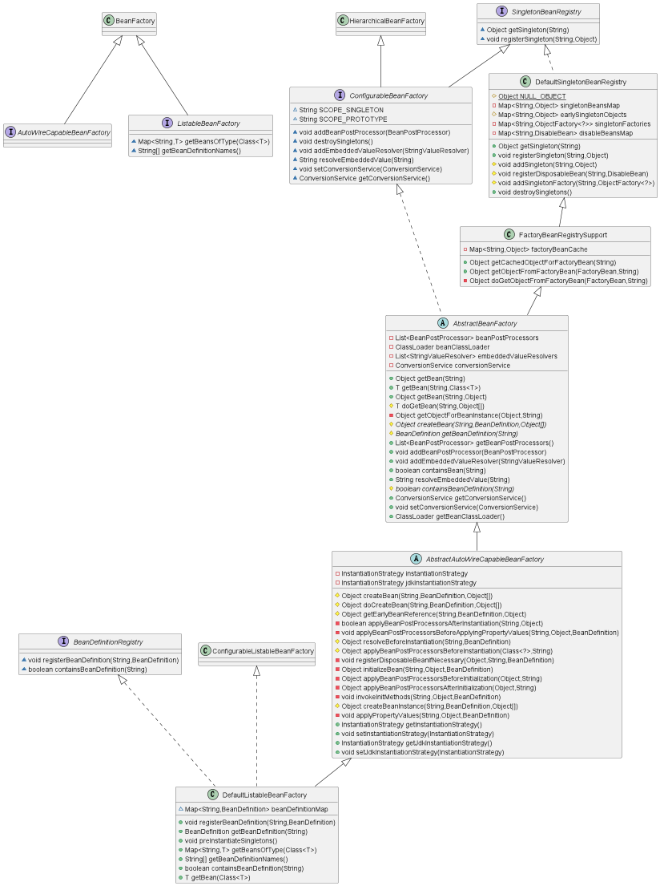
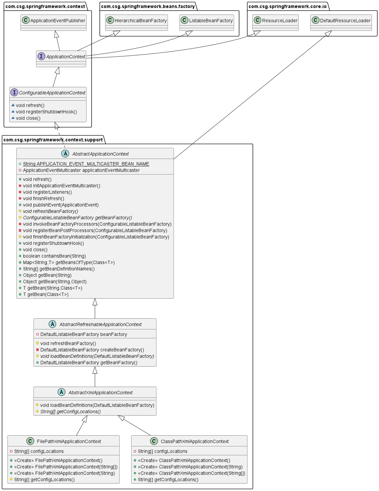
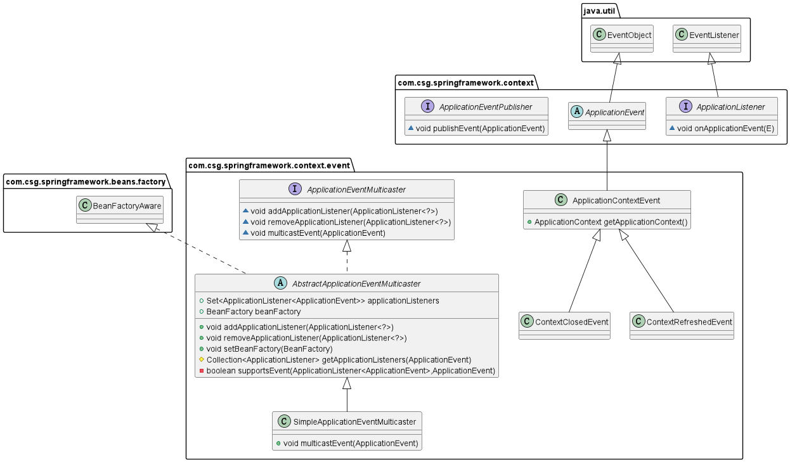
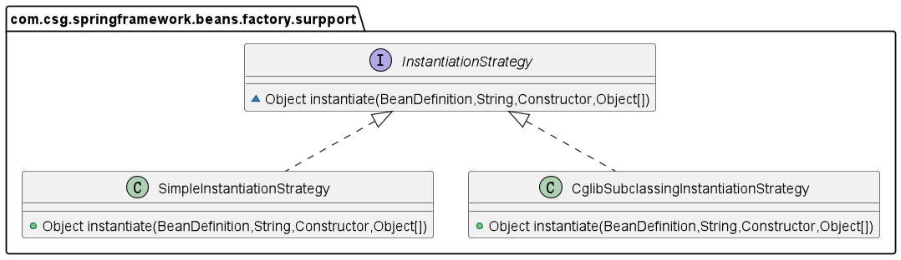
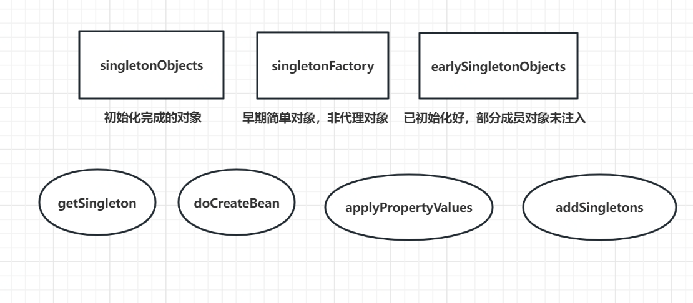
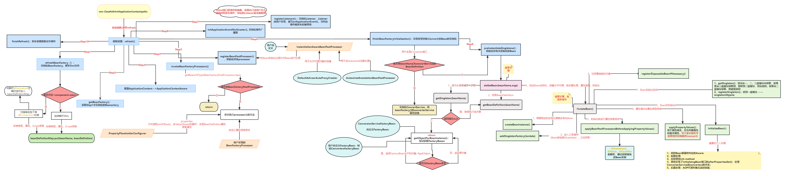
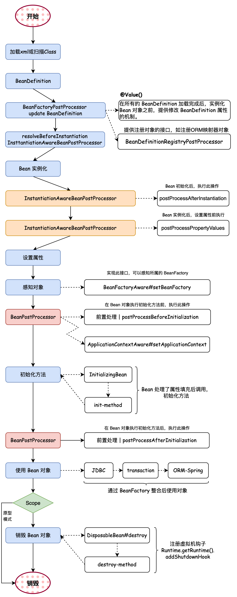

# 一、项目简介
Easy-Spring是一个基于Spring框架实现的简化版Spring框架，该项目实现了Spring框架核心功能，如：IOC、AOP、Bean生命周期、作用域、资源解析处理、事件发布、数据类型转换、循环依赖的解决。
同时，该项目运用了常见设计模式以及抽象设计思想，使得Easy-Spring框架具有高扩展性与松耦合性，便于用户在该框架基础上进行二次开发。
## 功能介绍
1. 结合工厂模式、策略模式、模板方法模式、适配器模式等常见设计模式完整实现IOC功能并逐步完善Bean生命周期；
2. 基于JDK、Cglib动态代理，整合AspectJ框架实现基本的AOP功能，并将AOP扩展到Bean的生命周期；
3. 基于观察者设计模式实现简单的事件驱动功能；
4. 向虚拟机注册钩子，实现JVM关闭时相关Bean的销毁方法自动调用；
5. 通过注解和反射实现了Bean自动扫描注册以及属性注入；
6. 使用三级缓存策略解决Bean属性注入时的循环依赖问题；
# 二、运用设计模式：
## 1、单例模式：
在该项目中bean的默认作用域就是`singleton`，同时还有`prototype`，即每一次`#getBean()`都会创建新的对象。单例Bean最终被存放在`singletonObjects`中，它是一个ConcurrentHashMap容器。
## 2、代理模式：
该项目中AOP就是基于动态代理实现的，即代理关系在运行时确定(`代理对象被创建时`)，代理对象在预编译期不存在，其原理是在程序运行过程中，动态生成字节码，对被代理方法进行增强。其中分为JDK动态代理和Cglib动态代理，代理对象在代理方法中调用了用户实现的Advice方法对目标方法进行增强。
## 3、模板方法模式：
该项目中有大量的抽象类，这些抽象类中的抽象方法形成了一套流程(`算法`)，类似于一套模板，同时这些抽象类里的具体方法也会调用其抽象方法，这些被调用的抽象方法就是所谓的钩子方法，延迟到实现钩子方法的子类执行。
## 4、简单工厂模式
该项目中的BeanFactory就是简单工厂模式的体现，它实现延迟注入(使用到某个 bean 的时候才会注入),相比于BeanFactory来说会占用更少的内存，程序启动速度更快。

ApplicationContext ：容器启动的时候，不管是否使用，一次性创建所有 bean 。BeanFactory 仅提供了最基本的依赖注入支持，ApplicationContext 扩展了 BeanFactory ,除了有BeanFactory的功能还有额外更多功能，所以一般开发人员使用ApplicationContext会更多。

## 5、工厂方法模式
项目中的工厂方法模式体现在FactoryBean<T\>接口。用户实现T类型的FactoryBean接口，重写getObject()方法，返回一个T类型的对象，该对象就会被放入到Spring容器中。典型的例子有spring与mybatis的整合，在Xml文件中配置一个SqlSessionFactory，实际上返回的是一个可进行执行Mybatis.xml中SQL的实例。
```xml
  <!-- 配置SessionFactory的Bean -->
    <bean id="sessionFactory" class="org.mybatis.spring.SqlSessionFactoryBean">

        <!-- 注入数据源 -->
        <property name="dataSource" ref="dataSource"/>

        <!-- 指定MyBatis配置文件的位置 -->
        <property name="configLocation" value="classpath:mybatis.xml"/>

        <!-- 给实体类起别名 -->
        <property name="typeAliasesPackage" value="com.tjise.entity"/>

    </bean>
```
## 6、适配器模式
所谓适配器模式，就是用于让两个不兼容的类一起工作。适配器模式有三大核心：Adapter(适配器)、TargetInterface(目标接口)、Adaptee(适配者)，其中适配者是适配器的一个属性，由于适配器又实现了目标接口，所以目标接口的实现类和Adaptee就能在一起工作了。
在本项目中，DisposableBeanAdapter、DisposableBean、没有实现DisposableBean接口但具有<init-method\>属性的Bean就充当以上三个角色，最后对象的销毁操作就可以对DisposableBean实现类的Bean和有<init-method\>属性的Bean做统一销毁处理和销毁方法的Bean。本项目中在对Converter的实现过程中也用到了适配器模式。
```java
public class DisposableBeanAdapter implements DisableBean {

    private final Object bean;
    private final Object beanName;
    private String destroyMethodName;

    public DisposableBeanAdapter(Object bean, Object beanName, BeanDefinition beanDefinition) {
        this.bean = bean;
        this.beanName = beanName;
        this.destroyMethodName = beanDefinition.getDestroyMethodName();
    }

    @Override
    public void destroy() throws Exception {
        //.......
    }
}
```
## 7、观察者模式
观察者模式也称作监听模式，即观察与被观察的关系，指对象之间一对多的依赖关系，每当那个特定对象(Event)改变状态时，所有依赖于它的对象(Listener)都会得到通知并被自动更新。
观察者模式中有三大核心组件：
1. 观察者(Listener): 负责监听事件
2. 事件(Event): 由用户创建，将消息交给publisher。在该项目中应用上下文(`ApplicationContext`)就充当了Publisher角色，所以它提供了`publishEvent()`方法给用户。在ApplicationContext内部聚合了广播器(`EventMulticaster`)，它就是真正的publisher
3. 事件发布者(publisher)：将用户传过来的事件发布出去，让对应事件的Listener处理。内部聚合了Listener集合，当用户调用发布事件的功能时，会遍历所有Listener，找出对应事件的Listener，执行其`onApplicationEvent()`
在该项目中，简单的事件驱动功能就是基于观察者模式实现的。事件类型有：容器关闭事件(`ContextClosedEvent`)、容器刷新事件(`ContextRefreshedEvent`)、用户自定义的事件。用户自定义事件、自定义监听器、将事件对象和监听器对象交给Easy-Spring管理，框架会在容器刷新过程将Listener对象放进`applicationListeners`集合中。

## 8、策略模式
策略者模式的三大核心组件：
1. 抽象策略: 代表一类事件，同常是接口或抽象类
2. 具体策略: 抽象策略的实现类
3. 策略的服务: 聚合了抽象策略，根据用户选择的策略采取具体策略进行操作
在Easy-Spring开发过程中，起初，对象的实例化是通过反射`#newInstance()`实现的，但是当对象有多个构造函数时，这种方法就不太适用，所以引入了两种具体的实例化策略：`JdkInstantiationStrategy`、`CglibInstantiationStrategy`, 它俩都实现了`InstantiationStrategy`接口。

```java
public abstract class AbstractAutoWireCapableBeanFactory extends AbstractBeanFactory {

    // 聚合策略者，根据入参类型来实例化
    private InstantiationStrategy instantiationStrategy = new CglibSubclassingInstantiationStrategy();
    private InstantiationStrategy jdkInstantiationStrategy = new SimpleInstantiationStrategy();
    
    @Override
    protected Object createBean(String beanName, BeanDefinition beanDefinition, Object[] args) {
        Object bean = null;
        bean = createBeanInstance(beanName, beanDefinition, args);
        addSingleton(beanName, bean);
        return bean;
    }

    protected Object createBeanInstance(String beanName, BeanDefinition beanDefinition, Object[] args) {
        Constructor constructorToUse = null;
        Class beanClass = beanDefinition.getBeanClass();
        // 遍历该类的所有构造器
        Constructor<?>[] declaredConstructors = beanClass.getDeclaredConstructors();
        for (Constructor<?> ctor : declaredConstructors) {
            // 如果构造器的参数个数等于用户传入的参入个数，则选择此构造器
            if (null != args && ctor.getParameterTypes().length == args.length) {
                constructorToUse = ctor;
                break;
            }
        }
        return getJdkInstantiationStrategy().instantiate(beanDefinition, beanName, constructorToUse, args);
    }
}
```
# 三级缓存解决循环依赖：
1，一级缓存singletonObjects：一级缓存存放的是已经初始化好的bean，即已经完成初始化好的注入对象的代理
2. 二级缓存earlySingletonObjects：二级缓存存放的是还没有完全被初始化好的中间对象代理，即已经生成了bean但是这个bean还有部分成员对象还未被注入进来
3. 三级缓存singletonFactory：三级缓存存放的是还未初始化完的bean，而这些bean只是早期的简单对象，并不是代理对象

# 四、整体流程：


# 四、参考资料
在手写Spring的实现中参考了tiny-spring、mini-spring、small-spring这三个项目，并在它们的基础上进行拓展，同时我还为small-spring项目中的bug修复提过pr且被作者merge。
参考项目地址：

https://github.com/code4craft/tiny-spring;

https://github.com/DerekYRC/mini-spring;

https://github.com/fuzhengwei/small-spring;
