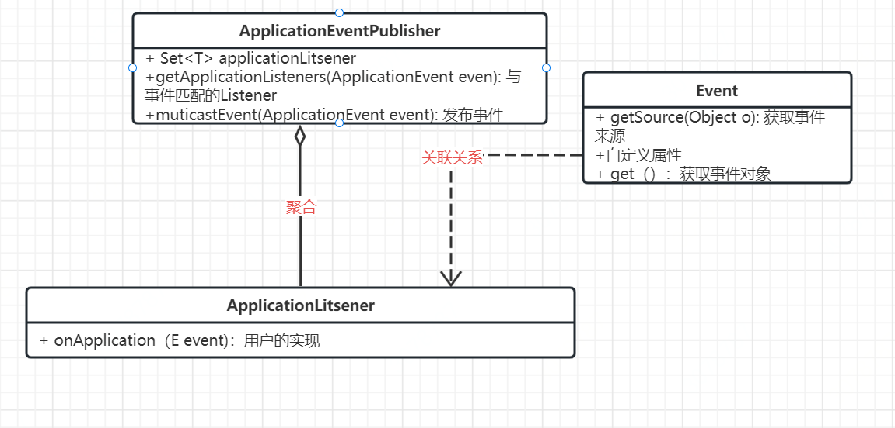

#  一、项目简介
Easy-Spring是一个基于Spring框架实现的简化版Spring框架，该项目实现了Spring框架核心功能，如：IOC、AOP、Bean生命周期、作用域、资源解析处理、事件发布、数据类型转换、循环依赖的解决。
同时，该项目运用了常见设计模式以及抽象设计思想，使得Easy-Spring框架具有高扩展性与松耦合性，便于用户在该框架基础上进行二次开发。
## 功能介绍
1. 结合工厂模式、策略模式、模板方法模式、适配器模式等常见设计模式完整实现IOC功能并逐步完善Bean生命周期；
2. 基于JDK、Cglib动态代理，整合AspectJ框架实现基本的AOP功能，并将AOP扩展到Bean的生命周期；
3. 基于观察者设计模式实现简单的事件驱动功能；
4. 向虚拟机注册钩子，实现JVM关闭时相关Bean的销毁方法自动调用；
5. 通过注解和反射实现了Bean自动扫描注册以及属性注入；
6. 使用三级缓存策略解决Bean属性注入时的循环依赖问题；
# 二、运用设计模式：
## 1、单例模式：
在该项目中bean的默认作用域就是`singleton`，同时还有`prototype`，即每一次`#getBean()`都会创建新的对象。单例Bean最终被存放在`singletonObjects`中，它是一个ConcurrentHashMap容器。
## 2、代理模式：
该项目中AOP就是基于动态代理实现的，即代理关系在运行时确定(`代理对象被创建时`)，代理对象在预编译期不存在，其原理是在程序运行过程中，动态生成字节码，对被代理方法进行增强。其中分为JDK动态代理和Cglib动态代理，代理对象在代理方法中调用了用户实现的Advice方法对目标方法进行增强。
## 3、模板方法模式：
该项目中有大量的抽象类，这些抽象类中的抽象方法形成了一套流程(`算法`)，类似于一套模板，同时这些抽象类里的具体方法也会调用其抽象方法，这些被调用的抽象方法就是所谓的钩子方法，延迟到实现钩子方法的子类执行。
## 4、简单工厂模式
该项目中的BeanFactory就是简单工厂模式的体现，它实现延迟注入(使用到某个 bean 的时候才会注入),相比于BeanFactory来说会占用更少的内存，程序启动速度更快。

ApplicationContext ：容器启动的时候，不管是否使用，一次性创建所有 bean 。BeanFactory 仅提供了最基本的依赖注入支持，ApplicationContext 扩展了 BeanFactory ,除了有BeanFactory的功能还有额外更多功能，所以一般开发人员使用ApplicationContext会更多。

## 5、工厂方法模式
项目中的工厂方法模式体现在FactoryBean<T\>接口。用户实现T类型的FactoryBean接口，重写getObject()方法，返回一个T类型的对象，该对象就会被放入到Spring容器中。典型的例子有spring与mybatis的整合，在Xml文件中配置一个SqlSessionFactory，实际上返回的是一个可进行执行Mybatis.xml中SQL的实例。
```xml
  <!-- 配置SessionFactory的Bean -->
    <bean id="sessionFactory" class="org.mybatis.spring.SqlSessionFactoryBean">

        <!-- 注入数据源 -->
        <property name="dataSource" ref="dataSource"/>

        <!-- 指定MyBatis配置文件的位置 -->
        <property name="configLocation" value="classpath:mybatis.xml"/>

        <!-- 给实体类起别名 -->
        <property name="typeAliasesPackage" value="com.tjise.entity"/>

    </bean>
```
## 6、适配器模式
所谓适配器模式，就是用于让两个不兼容的类一起工作。适配器模式有三大核心：Adapter(适配器)、TargetInterface(目标接口)、Adaptee(适配者)，其中适配者是适配器的一个属性，由于适配器又实现了目标接口，所以目标接口的实现类和Adaptee就能在一起工作了。
在本项目中，DisposableBeanAdapter、DisposableBean、没有实现DisposableBean接口但具有<init-method\>属性的Bean就充当以上三个角色，最后对象的销毁操作就可以对DisposableBean实现类的Bean和有<init-method\>属性的Bean做统一销毁处理和销毁方法的Bean。本项目中在对Converter的实现过程中也用到了适配器模式。
```java
public class DisposableBeanAdapter implements DisableBean {

    private final Object bean;
    private final Object beanName;
    private String destroyMethodName;

    public DisposableBeanAdapter(Object bean, Object beanName, BeanDefinition beanDefinition) {
        this.bean = bean;
        this.beanName = beanName;
        this.destroyMethodName = beanDefinition.getDestroyMethodName();
    }

    @Override
    public void destroy() throws Exception {
        //.......
    }
}
```
## 7、观察者模式(事件驱动功能)
观察者模式也称作监听模式，即观察与被观察的关系，指对象之间一对多的依赖关系，每当那个特定对象(Event)改变状态时，所有依赖于它的对象(Listener)都会得到通知并被自动更新。
观察者模式中有三大核心组件：
1. 观察者(`Listener`)：负责监听事件，用户实现`ApplicationListener<T>`接口来监听T类型的事件，它和Event是一对多的关系。	
2. 事件(`Event`): 由用户实现Event接口，将消息交给publisher。在该项目中应用上下文(`ApplicationContext`)就充当了Publisher角色，所以它提供了`publishEvent()`方法给用户。在ApplicationContext内部聚合了广播器(`SimpleApplicationEventMulticaster`)，它就是真正的publisher。
3. 事件发布者(publisher)：将用户传过来的事件发布出去，让对应事件的Listener处理。内部聚合了Listener集合，当用户调用发布事件的功能时，会遍历所有Listener，找出对应事件的Listener，执行其`onApplicationEvent()`
    在该项目中，简单的事件驱动功能就是基于观察者模式实现的。事件类型有：容器关闭事件(`ContextClosedEvent`)、容器刷新事件(`ContextRefreshedEvent`)、用户自定义的事件。用户自定义事件、自定义监听器、将事件对象和监听器对象交给Easy-Spring管理，框架会在容器刷新过程将Listener对象放进`applicationListeners`集合中。


### I.Easy-Spring中内置的容器事件：


### II.Listener中的方法何时被调用？

```java
	// AbstractApplicationContext中的方法
	@Override
    public void publishEvent(ApplicationEvent event) {
        applicationEventMulticaster.multicastEvent(event);
    }
```

```java
// SimpleApplicationEventMulticaster中的方法
/**
     * 获取与event相匹配的监听器集合，依次调用这些listener的onApplicationEvent()方法，具体方法由用户实现
     * @param event
     */
    @Override
    public void multicastEvent(ApplicationEvent event) {
        for (ApplicationListener listener : getApplicationListeners(event)) {
            listener.onApplicationEvent(event);
        }
    }
```

```java
// AbstractApplicationEventMulticaster中的方法
protected Collection<ApplicationListener> getApplicationListeners(ApplicationEvent event) {
        LinkedList<ApplicationListener> allListeners = new LinkedList<>();
        for (ApplicationListener<ApplicationEvent> listener : applicationListeners) {
            // 在supportEvent()中进行过滤
            if (supportsEvent(listener, event)) {
                allListeners.add(listener);
            }
        }
        return allListeners;
    }
 /**
     * 通过反射获取泛型类型：判断listener和event是否有关联关系
     */
    private boolean supportsEvent(ApplicationListener<ApplicationEvent> listener, ApplicationEvent event) {
        // 获取用户实现的监听器的类型，如果实例化策略是Cglib，则实际上是监听器的代理类
        Class<? extends ApplicationListener> listenerClass = listener.getClass();
        // 获取监听器的实际类型
        // 如果是JDK的代理类，则返回其父类
        Class<?> targetClass = ClassUtils.isCglibProxyClass(listenerClass) ? listenerClass.getSuperclass() : listenerClass;
        // 获取listener的接口类型
        Type genericInterface = targetClass.getGenericInterfaces()[0];
        // ParameterizedType：带有参数的类型，即泛型类
        // 将接口强转为泛型类，获取listener所监听事件的具体类型
        Type actualTypeArgument = ((ParameterizedType) genericInterface).getActualTypeArguments()[0];
        // 获取listener所监听事件的具体类型的className
        String className = actualTypeArgument.getTypeName();
        Class<?> eventClass;
        try {
            // 获取listener所监听事件的具体类型的Class对象
            eventClass = Class.forName(className);
        } catch (ClassNotFoundException e) {
            throw new BeanException("wrong event class name: " + className);
        }
        // isAssignableFrom是用来判断子类和父类或者接口与实现类关系的，
        // 如果A.isAssignableFrom(B)结果是true，证明B可以转换成为A
        // 如果event的class和ApplicationListener<T>中的T的class有关联关系，说明二者匹配上了
        return eventClass.isAssignableFrom(event.getClass());
    }
```

### III. 观察者模式中三种角色的关系

## 8、策略模式

策略者模式的三大核心组件：
1. 抽象策略: 代表一类事件，同常是接口或抽象类
2. 具体策略: 抽象策略的实现类
3. 策略的服务: 聚合了抽象策略，根据用户选择的策略采取具体策略进行操作
在Easy-Spring开发过程中，起初，对象的实例化是通过反射`#newInstance()`实现的，但是当对象有多个构造函数时，这种方法就不太适用，所以引入了两种具体的实例化策略：`JdkInstantiationStrategy`、`CglibInstantiationStrategy`, 它俩都实现了`InstantiationStrategy`接口。

```java
public abstract class AbstractAutoWireCapableBeanFactory extends AbstractBeanFactory {

    // 聚合策略者，根据入参类型来实例化，同时提供InstantiationStrategy的set#方法
    private InstantiationStrategy instantiationStrategy =  new SimpleInstantiationStrategy();
    
    @Override
    protected Object createBean(String beanName, BeanDefinition beanDefinition, Object[] args) {
        Object bean = null;
        bean = createBeanInstance(beanName, beanDefinition, args);
        addSingleton(beanName, bean);
        return bean;
    }

    protected Object createBeanInstance(String beanName, BeanDefinition beanDefinition, Object[] args) {
        Constructor constructorToUse = null;
        Class beanClass = beanDefinition.getBeanClass();
        // 遍历该类的所有构造器
        Constructor<?>[] declaredConstructors = beanClass.getDeclaredConstructors();
        for (Constructor<?> ctor : declaredConstructors) {
            // 如果构造器的参数个数等于用户传入的参入个数，则选择此构造器
            if (null != args && ctor.getParameterTypes().length == args.length) {
                constructorToUse = ctor;
                break;
            }
        }
        return getJdkInstantiationStrategy().instantiate(beanDefinition, beanName, constructorToUse, args);
    }
}
```
# 三、向虚拟机注册钩子

`Runtime.getRuntime().addShutdownHook(Thread t)`
像虚拟机注册钩子就是实现虚拟机内部的钩子方法，当虚拟机即将关闭时，会自动调用我们实现的钩子方法，这种方法常用于以下场景：

1. 程序执行完的后续操作；
2. 监测服务器宕机；
3. 执行备机启动操作； 

```java
public abstract class AbstractApplicationContext extends DefaultResourceLoader implements ConfigurableApplicationContext {
// ............
	@Override
    public void registerShutdownHook() {
        Runtime.getRuntime().addShutdownHook(new Thread(this::close));
    }
	// 将实现了DisbleBean接口的Bean和配置了<init-method>的Bean从disableBeansMap、singletonObjects中移除（及切断引用链，之后被gc），然后执行用户自定义的销毁方法
    @Override
    public void close() {
        // 发布容器关闭事件
        publishEvent(new ContextClosedEvent(this));
        getBeanFactory().destroySingletons();
    }
    
    public void destroySingletons() {
        Set<String> keySet = this.disableBeansMap.keySet();
        Object[] disableBeanName = keySet.toArray();
        for (Object beanName : disableBeanName) {
            // System.out.println("--"+beanName);
            DisableBean disableBean = disableBeansMap.remove(beanName);
            // 从singletonBeanMap中移除
            singletonBeansMap.remove(beanName);
            if (null == disableBean) {
                throw new BeanException("you couldn't invoke registerShutdownHook method twice");
            }
            try {
                disableBean.destroy();
            } catch (Exception e) {
                throw new BeanException("Destroy method on bean with name '" + beanName + "' threw an exception", e);
            }
        }
    }
 //.............
}
```

​	

# 四、三级缓存解决循环依赖：

1，一级缓存singletonObjects：一级缓存存放的是已经初始化好的bean，即已经完成初始化好的注入对象的代理
2. 二级缓存earlySingletonObjects：二级缓存存放的是还没有完全被初始化好的中间对象代理，即已经生成了bean但是这个bean还有部分成员对象还未被注入进来
3. 三级缓存singletonFactory：三级缓存存放的是还未初始化完的bean，而这些bean只是早期的简单对象，并不是代理对象


# 五、AOP的实现过程

## 1、AOP是何时整合进Spring生命周期中的？

Bean实例化之后进行属性填充，属性填充之后执行Bean的初始化。初始化，要做四件事：

1. 将用户自定义的感知对象所要感知的容器组件暴露给用户
2. 执行初始化方法的前置处理（postProcessBeforeInitialization）
3. 执行初始化方法，初始化方法就是在Spring.xml中的<init-method\>,
4. 执行初始化后的后置处理（postProcessAfterInitialization）

AOP就是通过在执行初始化后置处理的过程中，将创建代理对象的逻辑加入进来的，那么要通过后置处理的方法来创建AOP增强对象，那么就必须有一个BeanPostProcessor的实现类来完成这个操作，该类就是`DefaultAdvisorAutoProxyCreator`，该类也需要我们在Spring.xml中定义，将其交给Spring容器管理。它还实现了`BeanFactoryAware`,目的就是感知BeanFactory，在DefaultAdvisorAutoProxyCreator实例初始化过程中，它的DefaultListableBeanFactory属性被复制。

```java
public class DefaultAdvisorAutoProxyCreator implements InstantiationAwareBeanPostProcessor, BeanFactoryAware {

    private DefaultListableBeanFactory beanFactory;
    // 实例化之前的后置处理，有几个对象，该方法就被调用几次

    private final Set<Object> earlyProxyReferences = Collections.synchronizedSet(new HashSet<>());
}
```

## 2、AOP中谁承担了切面的角色？

`AspectJExpressionPointcutAdvisor`就是切面这一概念的抽象。**切点、通知、切点表达式**都是它的属性。切面的实例也需要交给Spring容器管理，需要我们在配置文件中定义。同时，它与通知(增强)是一对一的关系，当前实例有几个通知就有几个切面。**切面对象在尝试创建代理对象的过程中被创建。**当所有切面被创建后，通过所有切面`(advisors)`去匹配当前Bean，判断当前Bean是否被当前切面增强，如果是则封装一个`AdviceSupport`对象，将AdviceSupport实例交给ProxyFactory，让其根据该实例AdviceSupport去帮忙创建AOP代理对象。

```java
protected Object wrapIfNecessary(Object bean, String beanName) {
        // 如果是Advice/Pointcut/Advisor，则不处理，否则StackOverflow，因为后面会递归调用getBeansOfType()
        // 一直爆栈，没把握好递归出口
        if (isInfrastructureClass(bean.getClass())) return bean;
        // 通过注册信息中实例化并获取所有切点表达式的访问者
        Collection<AspectJExpressionPointcutAdvisor> advisors = beanFactory.getBeansOfType(AspectJExpressionPointcutAdvisor.class)
                .values();
        // 让所有切点表达式访问者们去判断当前类是否需要创建代理对象
        try {
            ProxyFactory factory = new ProxyFactory();
            for (AspectJExpressionPointcutAdvisor advisor : advisors) {
                ClassFilter classFilter = advisor.getPointcut().getClassFilter();
                // 如果与当前类匹配不上，说明当前类中的方法不需要增强
                if (!classFilter.matches(bean.getClass())) continue;
                TargetSource targetSource = new TargetSource(bean);
                factory.setTargetSource(targetSource);
                factory.addAdvisor(advisor);
                factory.setMethodMatcher(advisor.getPointcut().getMethodMatcher());
            }
            if (!factory.getAdvisors().isEmpty()) {
                return factory.getProxy();
            }
        } catch (Exception e) {
            throw new BeanException("Error create proxy bean for: " + beanName, e);
        }
        return bean;
    }
```


```java
public class AspectJExpressionPointcutAdvisor implements PointcutAdvisor {
    // 切点
    private AspectJExpressionPointcut pointcut;

    // 通知对象，当设置属性时，其实是被包装为MethodInterceptor，并非用户实现Advice
    // Advice可以是前置通知，也可以是后置通知
    private Advice advice;

    // 表达式
    private String expression;


    @Override
    public Advice getAdvice() {
        return this.advice;
    }

    public void setAdvice(Advice advice) {
        this.advice = advice;
    }

    @Override
    public Pointcut getPointcut() {
        if (null == pointcut) {
            pointcut = new AspectJExpressionPointcut(expression);
        }
        return pointcut;
    }

    public void setPointcut(AspectJExpressionPointcut pointcut) {
        this.pointcut = pointcut;
    }


    public void setExpression(String expression) {
        this.expression = expression;
    }

}
```

## 3、谁承担了切点的角色？

AspectJExpressionPointcut，**该类与AspectJ框架整合**，AspectJ框架在该类中的作用就是帮助我们解析切点表达式，判断切点表达式是否能够和当前Bean匹配上。

```java
package com.csg.springframework.aop.aspectj;
/...
// aspectj的织入工具
import org.aspectj.weaver.tools.PointcutExpression;
import org.aspectj.weaver.tools.PointcutParser;
import org.aspectj.weaver.tools.PointcutPrimitive;
/...
public class AspectJExpressionPointcut implements Pointcut, MethodMatcher, ClassFilter {
    //Set中放的是该切点支持的切点表达式类型
    private static final Set<PointcutPrimitive> SUPPORTED_PRIMITIVES = new HashSet<>();

    static {
        // 支持execution表达式
        SUPPORTED_PRIMITIVES.add(PointcutPrimitive.EXECUTION);
    }
    private final PointcutExpression pointcutExpression;

    public AspectJExpressionPointcut(String expression) {
        // 获取切点表达式的解析器，该解析器只有能解析在SUPPORTED_PRIMITIVES中的切点表达式类型
        PointcutParser pointcutParser = PointcutParser.getPointcutParserSupportingSpecifiedPrimitivesAndUsingSpecifiedClassLoaderForResolution(SUPPORTED_PRIMITIVES, this.getClass().getClassLoader());
        // 用切点解析器解析表达式，返回PointcutExpression对象
        this.pointcutExpression = pointcutParser.parsePointcutExpression(expression);
    }

    @Override
    public boolean matches(Class<?> clazz) {
        return pointcutExpression.couldMatchJoinPointsInType(clazz);
    }

    @Override
    public boolean matches(Method method, Class<?> targetClass) {
        return pointcutExpression.matchesMethodExecution(method).alwaysMatches();
    }

    @Override
    public ClassFilter getClassFilter() {
        return this;
    }

    @Override
    public MethodMatcher getMethodMatcher() {
        return this;
    }
}
```


## 4、AdviceSupport是干嘛的？

包装**代理对象创建方式**、**目标对象**、**目标对象的切面集合**、**获取拦截器链(`通知集合`)的方法**。

```java
public class AdvisedSupport {
    // 是否使用Cglib动态代理，默认为true
    private boolean proxyTargetClass = true;

    // 被代理的目标对象
    private TargetSource targetSource;

    // 切面集合
    private List<Advisor> advisors = new ArrayList<>();
    
    // 方法匹配器，查看目标方法是否符合通知条件
    private MethodMatcher methodMatcher;
    
    // 拦截器中方法缓存
    private transient Map<Integer, List<Object>> methodCache;
    
    // 拦截器链工厂
    AdvisorChainFactory advisorChainFactory = new DefaultAdvisorChainFactory();

    public AdvisedSupport() {
        this.methodCache = new ConcurrentHashMap<>(32);
    }

   //...get/set
    public void addAdvisor(Advisor advisor) {
        advisors.add(advisor);
    }
    // 获取当前方法的所有拦截器
    public List<Object> getInterceptorsAndDynamicInterceptionAdvice(Method method, Class<?> targetClass) {
        Integer cacheKey = method.hashCode();
        List<Object> cached = this.methodCache.get(cacheKey);
        if (null == cached) {
            List<Object> interceptors = advisorChainFactory.getInterceptorsAndDynamicInterceptionAdvice(this, method, targetClass);
            cached = interceptors;
            this.methodCache.put(cacheKey, cached);
        }
        return cached;
    }
}
```

该类中有一个`AdvisorChainFactory`属性，它的作用是**创建拦截器链**，它会通过`AdviceSupport`获取所有切面(`advisors`)，然后根据所有切面去获取**用户实现的通知对象**。	

# 五、Easy-Spring中的拓展点

 ## 1、BeanPostProcessor接口

BeanPostProcessor，即Bean的后置处理器，在Bean实例化与属性填充后起作用。该接口不仅可以提供给框架开发者使用以扩展框架功能，还可以提供给框架用户实现对目标Bean做一些处理。在Easy-Spring中，有几个内置的`BeanPostProcessor`。

| BeanPostProcessor                    | 作用                                                         |
| :----------------------------------- | :----------------------------------------------------------- |
| AutowiredAnnotationBeanPostProcessor | 处理@Autowired、@Value注解                                   |
| DefaultAdvisorAutoProxyCreator       | 处理AOP切面的动态代理                                        |
| ApplicationContextAwareProcessor     | 处理ApplicationContextAware接口实现类，给用户实现类注入容器上下文对象 |

```java
public class ApplicationContextAwareProcessor implements BeanPostProcessor {

    private final ApplicationContext applicationContext;

    public ApplicationContextAwareProcessor(ApplicationContext applicationContext) {
        this.applicationContext = applicationContext;
    }
    // 注意该方法会被反复执行，所以该方法一定要是幂等的
    @Override
    public Object postProcessBeforeInitialization(Object bean, String beanName) throws BeanException {
        if (bean instanceof ApplicationContextAware) {
            ((ApplicationContextAware) bean).setApplicationContext(applicationContext);
        }
        return bean;
    }

    @Override
    public Object postProcessAfterInitialization(Object bean, String beanName) throws BeanException {
        return bean;
    }
}
```

### I. @Autowired、@Value、@Qualifier处理

`AutowiredAnnotationBeanPostProcessor`是BeanPostProcessor的实现类，它负责处理`@Autowired、@Value、@Qualifier`。

它是在Bean的属性填充前起作用的，在对Bean进行属性填充前会先解析这些注解，如果@Autowired修饰的属性的对象（`BeanA`）还未创建，则先创建(`BeanA`)，然后通过反射将BeanA注入到Bean中。

与Xml注入的方式不同，Xml的方式是在扫描xml文件时就已经将属性信息加入到了PropertyValues中，在`applyPropertyValues`中注入属性。 

```java
public class AutowiredAnnotationBeanPostProcessor implements InstantiationAwareBeanPostProcessor, BeanFactoryAware {
   
    private ConfigurableListableBeanFactory beanFactory;

    /**
     * 扫描bean中的Autowired/Qualifier/Value注解
     * 注意：在引入AOP时，该方法入参的bean必须目标对象，否则是获取不到类上的注解的
     */
    @Override
    public PropertyValues postProcessPropertyValues(PropertyValues pvs, Object bean, String beanName) throws BeanException {
        // 获取到了所有属性信息
        Class<?> clazz = bean.getClass();
        clazz = ClassUtils.isCglibProxyClass(clazz) ? clazz.getSuperclass() : clazz;
        Field[] fields = clazz.getDeclaredFields();
        for (Field field : fields) {
            Value valueAnnotation = field.getAnnotation(Value.class);
            if (null != valueAnnotation) {
                // 现在value时${xxx}的形式
                String value = valueAnnotation.value();
                // 通过${xxx}去配置文件中解析出真正的属性值
                value = beanFactory.resolveEmbeddedValue(value);
                BeanUtil.setFieldValue(bean, field.getName(), value);
            }
        }
        // 处理Autowired
        for (Field field : fields) {
            Autowired autowiredAnnotation = field.getAnnotation(Autowired.class);
            if (null != autowiredAnnotation) {
                Class<?> fieldType = field.getType();
                String dependentBeanName = null;
                Qualifier qualifierAnnotation = field.getAnnotation(Qualifier.class);
                Object dependentBean = null;
                if (null != qualifierAnnotation) {
                    dependentBeanName = qualifierAnnotation.value();
                    // 获取依赖的对象实例
                    dependentBean = beanFactory.getBean(dependentBeanName, fieldType);
                } else {
                    dependentBean = beanFactory.getBean(fieldType);
                }
                BeanUtil.setFieldValue(bean, field.getName(), dependentBean);
            }
        }
        return pvs;
    }
}
```

根据源码可以分析出，只使用@Autowired注解是根据类型注入的，如果搭配@Qualifier则是根据名称注入。根据类型注入有一个要求：**容器中只能存在一个当前类型的Bean，否则注入失败**。因为根据类型注入是通过类型(Class对象)去匹配BeanDefinitionMap中所有该类型的Bean，所以有可能存在多个不同名称但类型相同的Bean。

# 六、整体流程：

Xml/类文件扫描 -> BeanDefinition -> Bean实例化 -> BeanDefinition中属性信息修改 -> 属性赋值 -> 初始化`(执行初始化方法、前后置处理) `-> Bean的使用 -> Bean的销毁`(实现了DisabledBean接口)`


```java
@Override
    public void refresh() throws BeanException {
        // 1. 创建BeanFactory，加载BeanDefinition
        // 此时BeanDefinition已经被放入beanDefinitionMap中了
        refreshBeanFactory();
        // 2. 获取BeanFactory，这个BeanFactory是在refreshBeanFactory()过程中创建的
        ConfigurableListableBeanFactory beanFactory = getBeanFactory();
        // 3.添加 ApplicationContextAwareProcessor，让继承自 ApplicationContextAware 的 Bean 对象都能感知所属的 ApplicationContext
        // 也就是将当前ApplicationContext封装为ApplicationContextAwareProcessor
        beanFactory.addBeanPostProcessor(new ApplicationContextAwareProcessor(this));
        // 4. 在Bean实例化之前，实例化BeanFactoryPostProcessor，并执行postProcessBeanFactory()方法，此时已经完成用户自定义Bean的属性修改
        invokeBeanFactoryProcessors(beanFactory);
        // 5. BeanPostProcessors需要提前于其它Bean对象实例化之前进行注册操作，也就是将BeanPostProcessor实例放入到List<BeanPostProcessor>中
        registerBeanPostProcessors(beanFactory);
        // 6. 初始化事件发布者，将发布者实例化并交给Spring容器
        initApplicationEventMulticaster();
        // 7. 注册事件监听器，将所有listener实例化，并放入multicaster中的listener集合中
        registerListeners();
        // 8. 设置类型转换器、提前实例化单例Bean对象
        // preInstantiateSingletons()在设置类型转换器后被调用
        finishBeanFactoryInitialization(beanFactory);
        // 9.发布容器刷新完成事件
        finishRefresh();
    }
```


# 七、参考资料

在手写Spring的实现中参考了tiny-spring、mini-spring、small-spring这三个项目，并在它们的基础上进行拓展，同时我还为small-spring项目中的bug修复提过pr且被作者merge。
参考项目地址：

https://github.com/code4craft/tiny-spring;

https://github.com/DerekYRC/mini-spring;

https://github.com/fuzhengwei/small-spring;
